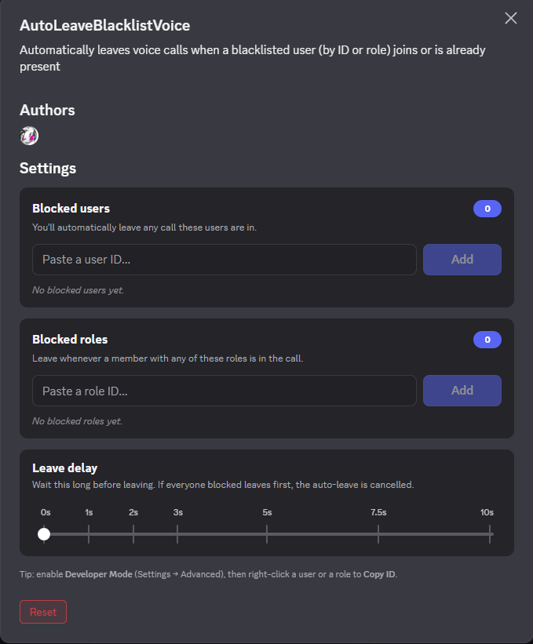

# AutoLeaveBlacklistVoice

> [!WARNING]
> **Update to the latest version.** Older builds could fail to leave the call (especially with the delay set to `0`, or when someone with a blacklisted **role** was already in the call). Fixed as of **June 25, 2026** — re-copy the `autoLeaveBlacklistVoice/` folder and rebuild your client mod.

A [Vencord](https://github.com/Vendicated/Vencord) / [Equicord](https://github.com/Equicord/Equicord) user plugin that automatically disconnects you from voice calls when a blacklisted user — **or anyone with a blacklisted role** — is present.

---

## Preview

<p align="center">
  
</p>

---

## Features

- **Blacklist by user ID** — add any number of Discord account IDs
- **Blacklist by role ID** — auto-leave whenever a member with one of these roles is in the call
- **Polished settings UI** — manage everything from a custom panel with removable chips (resolved usernames/avatars and colored role tags), live validation, and a delay slider
- **Configurable delay** — set a delay (0–10,000 ms) before the auto-leave triggers
- **Covers all call types** — guild voice channels, DMs, and Group DMs
- **Smart detection** — triggers both when a blacklisted user joins your call *and* when you join a call they're already in
- **Auto-cancel** — if all blacklisted users leave before the delay ends, the pending leave is cancelled
- **Toast notifications** — get notified when auto-leave is triggered or cancelled

---

## Installation

> Requires Vencord or Equicord with user plugin support enabled.

1. Clone or download this repository
2. Copy the `autoLeaveBlacklistVoice/` folder into your client mod's user plugins directory:

```
# Vencord
src/userplugins/autoLeaveBlacklistVoice/

# Equicord
src/userplugins/autoLeaveBlacklistVoice/
```

3. Rebuild your client mod:

```bash
pnpm build
# or for dev mode
pnpm watch
```

4. Go to **Settings → Plugins** and enable **AutoLeaveBlacklistVoice**

---

## Configuration

Everything is managed from the plugin's custom settings panel:

| Setting | Description |
|---|---|
| **Blocked users** | Paste one or more user IDs (space- or comma-separated) and click **Add** (or press Enter). Added users show up as chips with their avatar and name. |
| **Blocked roles** | Paste one or more role IDs to leave whenever a member with that role is in the call. Chips show the role's name and color. |
| **Leave delay** | Slider (Instant → 10s) controlling how long to wait before leaving. |

> You can paste a whole list of IDs at once — invalid entries and duplicates are skipped automatically.

### How to find a user or role ID

1. Enable **Developer Mode** in Discord settings (`Settings → Advanced → Developer Mode`)
2. Right-click a **user** → **Copy User ID**, or a **role** (Server Settings → Roles) → **Copy Role ID**

> Note: role detection relies on the member being cached by Discord. For people already in your call this is normally the case, but in very large servers a not-yet-loaded member might be missed — blacklisting by user ID is always reliable.

---

## How It Works

The plugin subscribes to Discord's internal `VOICE_STATE_UPDATES` Flux event and checks every voice state change against your blacklist (by user ID **and** by role).

**Auto-leave is triggered when:**
- You join a voice channel that already contains a blacklisted user/role
- A blacklisted user/role joins the voice channel you're currently in

**Auto-leave is cancelled when:**
- All blacklisted members leave the channel before the delay expires
- You manually disconnect from the call

When a delay is configured, a toast notification will appear counting down. If the condition is no longer met when the timer fires, no action is taken.

---

## Files

```
autoLeaveBlacklistVoice/
├── index.tsx     # plugin logic + settings UI
└── styles.css    # settings panel styling
```

---

## Changelog

### June 25, 2026
- **Fixed (important):** joining a call where a member with a blacklisted **role** was already present could fail to auto-leave — it would only "wake up" once some other voice event happened to fire. The plugin now re-scans on a short timer while you're connected and actively fetches members whose roles aren't cached yet, so role-based matches are caught reliably even in large servers (where member data loads lazily).
- **UI:** complete redesign of the settings panel — **Users / Roles tabs** with live counts, scrollable chip lists (avatars for users, role colors for roles), a delay control with both a **slider and quick presets**, and a **Clear all** button per list.
- **New:** a **Recent activity** log that records who was in the call each time the plugin auto-leaves (with the channel name and a relative time), so you can see what triggered it. The leave toast now also names the blocked member.

### June 24, 2026
- **Fixed:** with a non-zero leave delay the countdown could show ("leaving in 2000ms…") but never actually disconnect. A transient detection miss during the countdown — e.g. a member's roles loading a moment late — was cancelling the pending leave. A scheduled leave is no longer cancelled by a transient check; it simply re-checks once when the timer fires.
- **Fixed:** the plugin would sometimes stay in the call instead of leaving (most often with the delay set to 0). It tried to disconnect in the middle of Discord's own voice-state update, which Discord blocks — so the disconnect failed silently and you got stuck in the VC. The leave now always runs a moment later, outside that update, so it disconnects reliably every time.
- **Improved:** detection now re-scans the whole channel on every relevant change (more reliable than the old per-event checks) and no longer resets the leave countdown on unrelated updates.
- **Added:** a short safety re-check that catches blacklisted **roles** when a member's roles load a split second late.
- **Hardened:** disconnect now uses Discord's canonical leave action (with fallbacks) for reliability across client builds; current-channel detection uses `SelectedChannelStore`; malformed voice events are ignored safely.
- **Fixed:** blacklisting your **own** ID/role no longer kicks you out of every call (you're excluded from the check).
- **Added:** enabling the plugin while already in a call with a blacklisted member now acts immediately.
- **New:** blacklist by **role ID** — auto-leave when any member with a blacklisted role is in the call
- **New:** redesigned **settings UI** with chip-based user/role management (resolved avatars, names, and role colors), input validation, and a delay slider
- **New:** the Add field now accepts **multiple IDs at once** (space-, comma- or newline-separated) — invalid entries and duplicates are skipped, restoring bulk-paste from the UI
- **Optimized:** ID lookups now use `Set`-based matching (O(1)), blacklists are parsed once per event, and role resolution is memoized in the UI

---

## Requirements

- [Vencord](https://github.com/Vendicated/Vencord) or [Equicord](https://github.com/Equicord/Equicord)
- Node.js + pnpm (for building)

---

## License

GPL-3.0-or-later — same license as Vencord/Equicord.

---

## Author

**overocai** — `1288832011452153910`
